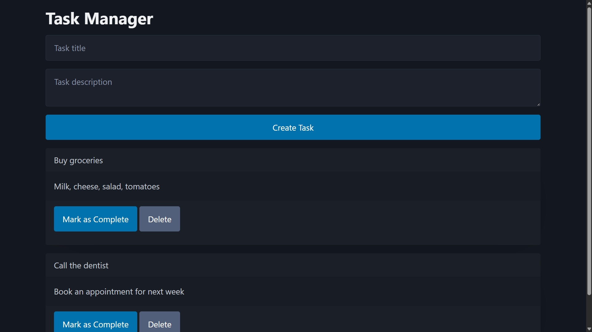
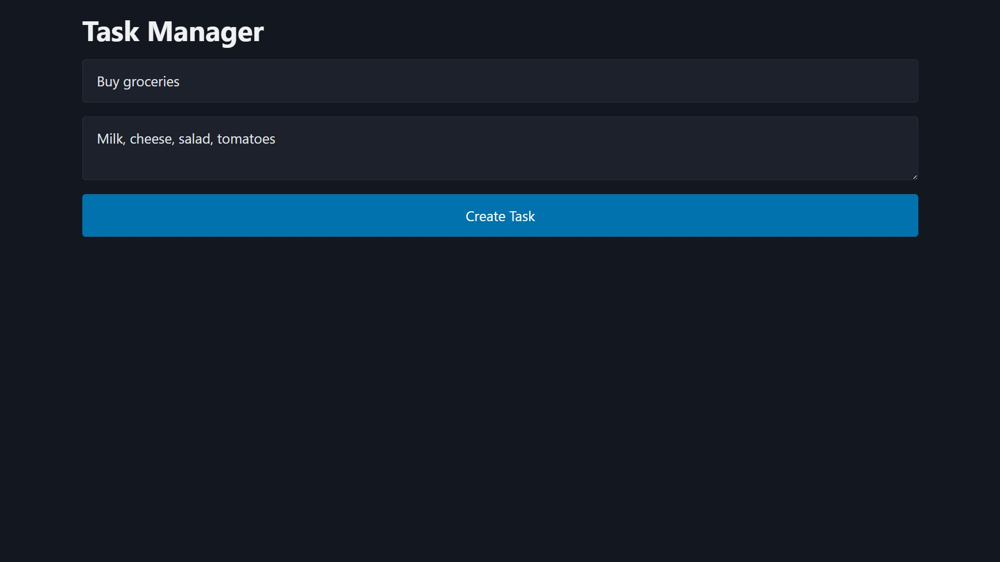

# Full Stack Task Manager




A robust, full-stack web application for managing a to-do list, built with a modern **Java and Spring Boot** stack. This project demonstrates core backend development principles including MVC architecture, database persistence with JPA, and dependency injection.

---

## Features

- **CRUD Functionality**: Full support for Creating, Reading, Updating, and Deleting tasks.  
- **Simple & Clean UI**: A minimalist, single-page interface for easy task management.  
- **Task Completion**: Mark tasks as complete with a single click, which visually distinguishes them with a strikethrough.  
- **Database Persistence**: All tasks are saved in a PostgreSQL database, ensuring data is retained across application restarts.  
- **Containerized Database**: The PostgreSQL database runs in Docker, ensuring a consistent and isolated development environment.  

---

## Tech Stack & Tools

### Backend
- **Java (17+)**: The core programming language for the application's logic.  
- **Spring Boot (3+)**: The primary framework for building the stand-alone, production-grade application.  
- **Spring Web**: Provides the MVC (Model-View-Controller) pattern to handle web requests.  
- **Spring Data JPA**: Simplifies database interactions by providing an abstraction layer over Hibernate.  
- **Hibernate**: The underlying ORM tool for mapping Java objects to database tables.  

### Frontend (View Layer)
- **Thymeleaf**: A modern server-side Java template engine for rendering dynamic HTML.  
- **HTML5**: The markup language for creating the web page structure.  
- **Pico.css**: A minimalist CSS framework for clean, semantic styling with minimal effort.  

### Database
- **PostgreSQL**: A powerful, open-source object-relational database system.  

### Build & Containerization
- **Apache Maven**: Manages project dependencies, builds, and packaging.  
- **Docker**: Used to run the PostgreSQL database in a lightweight, isolated container.  

---



## Prerequisites

You will need the following software installed on your machine:
- Java JDK 17 or newer  
- Apache Maven  
- Docker Desktop  

---

## Getting Started

Follow these instructions to get a local copy of the project up and running.

### Clone this repository
```bash
git clone https://github.com/Manuele-T/Java-Spring-Task-Tracker
cd Java-Spring-Task-Tracker
````

### Start the PostgreSQL Database with Docker

Run the following command in your terminal. This will download the PostgreSQL image and start a container in the background:

```bash
docker run --name my-postgres \
  -e POSTGRES_PASSWORD=mysecretpassword \
  -e POSTGRES_DB=taskdb \
  -p 5432:5432 \
  -d postgres
```

### Configure the Application

Update `src/main/resources/application.properties` to connect to the Dockerized database:

```properties
spring.datasource.url=jdbc:postgresql://localhost:5432/taskdb
spring.datasource.username=postgres
spring.datasource.password=mysecretpassword
spring.jpa.hibernate.ddl-auto=update
```

### Build and Run the Spring Boot Application

Use the Maven wrapper included in the project to build and run the application:

```bash
./mvnw spring-boot:run
```

### Access the Application

Open your browser and navigate to:
[http://localhost:8080](http://localhost:8080)

---

## Project Structure

The project follows the standard Maven directory layout:

```
taskmanager/
├── .mvn/
├── src/
│   ├── main/
│   │   ├── java/
│   │   │   └── com/yourname/taskmanager/
│   │   │       ├── Task.java                   # The JPA Entity (Data Model)
│   │   │       ├── TaskRepository.java         # The Spring Data JPA Repository
│   │   │       ├── TaskController.java         # The Spring MVC Controller
│   │   │       └── TaskManagerApplication.java # Main Spring Boot app class
│   │   └── resources/
│   │       ├── templates/
│   │       │   └── tasks.html                  # The Thymeleaf HTML template (GUI)
│   │       └── application.properties          # Application configuration
│   └── test/
├── mvnw
├── mvnw.cmd
└── pom.xml                                     # Maven project configuration
```
